# io-aware-attention-trainium

IO-aware FlashAttention experiments targeting self-hosted AWS Trainium (Trn2 single-chip baseline).

This repository is compatible with the CS149-style AWS setup (`ap-southeast-4`, `trn2.3xlarge`, Ubuntu SSH workflow with forwarded profiler ports).

## What this repository provides

- Forward-only SDPA benchmark harness (`naive`, `tiled_online`, `tiled_online_dbuffer`, plus distributed-merge variants).
- Reproducible run artifacts (`metrics.csv`, `metrics.jsonl`, `run_manifest.json`).
- Trainium host bootstrap and environment validation scripts.
- Optional result upload to S3.

## Quickstart (local CPU smoke, conda)

```bash
conda env create -f conda/environment.cpu.yml
conda activate ioattn-trn2
python scripts/run_bench.py --config configs/benchmark/smoke.yaml --variant naive --device cpu
```

If the env already exists:

```bash
conda env update -f conda/environment.cpu.yml --prune
conda activate ioattn-trn2
```

## Self-hosted Trn2 workflow

1. Push your code changes to GitHub.
2. SSH into Trn2 host and pull latest commit.
3. Run bootstrap (conda env update + validation).
4. Run benchmark/profiling command.

```bash
git pull
bash scripts/bootstrap_trainium_host.sh
conda activate ioattn-trn2
python scripts/validate_trainium_env.py
python scripts/run_bench.py --config configs/benchmark/canonical.yaml --variant tiled_online --device trainium
```

See full host instructions in `docs/TRAINIUM_SELF_HOSTED.md`.

## CS149 cloud compatibility notes

- Region default in env template is `ap-southeast-4` (Melbourne).
- Assumed instance type is `trn2.3xlarge`.
- Assumed SSH login user is `ubuntu`.
- For profiler UI access, connect with:

```bash
ssh -i /path/to/key.pem ubuntu@<public_dns_name> -L 3001:localhost:3001 -L 8086:localhost:8086
```

## Conda environment files

- CPU/local: `conda/environment.cpu.yml`
- Trainium host: `conda/environment.trainium.yml`

You can customize env name with `CONDA_ENV_NAME`, for example:

```bash
CONDA_ENV_NAME=fa-trn2 bash scripts/bootstrap_trainium_host.sh
```

## Main interfaces

- Benchmark:
  - `python scripts/run_bench.py --config <yaml> --variant <naive|tiled_online> --device trainium --output-dir <path>`
- 5-kernel scaling study (single-die vs real dual-rank collectives on Trn2):
  - `torchrun --nproc_per_node=2 scripts/run_kernel_study.py --config configs/experiments/trn2_kernel_study.yaml --device trainium --distributed`
- Plot kernel-study outputs:
  - `python scripts/plot_kernel_study.py --metrics-csv <run_dir>/metrics.csv --out-dir results/plots --prefix <name>`
- Dual-die what-if model (alpha/beta/overlap break-even sweep):
  - `python scripts/what_if_dual_die.py --metrics-csv <run_dir>/metrics.csv --collectives-json <run_dir>/collectives_summary.json --fabric-json <run_dir>/fabric_calibration.json --out-dir results/plots --prefix <name>`
- Phase-aware prefill/decode study:
  - `torchrun --nproc_per_node=2 scripts/run_phase_study.py --config configs/experiments/trn2_phase_study.yaml --device trainium --distributed`
- Plot phase-study outputs:
  - `python scripts/plot_phase_study.py --metrics-csv <run_dir>/metrics.csv --out-dir results/plots --prefix <name>`
- Validation:
  - `python scripts/validate_trainium_env.py`
- Optional S3 sync:
  - `python scripts/sync_results_s3.py --run-dir <results/run_id> --s3-uri <s3://bucket/prefix>`

## Full experiment: Trn2 single-die vs dual-rank collectives

### Objective

Evaluate five common transformer kernels on AWS Trainium2 and compare:

1. Single-die baseline.
2. Naive dual-die partitioning.
3. Communication-optimized dual-die partitioning.

### Hardware/runtime

- Instance: `trn2.3xlarge`
- Region used: `ap-southeast-4`
- Runtime: `torch-neuronx` + `torch_xla` with `torchrun --nproc_per_node=2`

### Kernel set and shapes

- Kernels: `qkv_proj`, `attention`, `mlp`, `rmsnorm`, `out_proj`
- Shapes in full config:
  - `(batch=1, seq_len=512, model_dim=1024, num_heads=16, mlp_ratio=4)`
  - `(batch=1, seq_len=1024, model_dim=1024, num_heads=16, mlp_ratio=4)`

### Dual-rank implementation details

- Dual paths run as real 2-rank execution over XLA collectives (`all_reduce`, `all_gather`) instead of byte-only emulation.
- Dual setup names:
  - `dual_die_naive`: straightforward partition + heavier collective traffic.
  - `dual_die_optimized`: reduced communication volume via kernel-specific partition/reduction strategy.
- Single-die native attention baseline:
  - `single_die_native` (attention-only): uses `torch.nn.functional.scaled_dot_product_attention` when available.

### Fabric calibration

Before kernels run, the harness calibrates collectives using:

- `ping_pong`-style roundtrip broadcasts
- `all_reduce`
- `all_gather`

Outputs:

- `fabric_calibration.csv`
- `fabric_calibration.json`

The run on **March 3, 2026** measured a peak calibrated fabric throughput of approximately **1.508537 GB/s**.

### Correctness gate

- Correctness is checked against single-die output per kernel/shape.
- Recorded metrics: `max_abs_err`, robust `max_rel_err` (numerically stable denominator).
- Gate fails when either threshold is exceeded:
  - `correctness_abs_tol: 0.05`
  - `correctness_rel_tol: 0.1`

### Key measured metrics

- End-to-end latency: `latency_ms_p50`, `latency_ms_p90`
- Decomposed timing: `compute_ms_p50`, `communication_ms_p50`, `overlap_pct_p50`
- Throughput: `throughput_tokens_per_s`
- Communication volume: `communication_bytes`, `communication_pct_of_hbm`
- Fabric use: `achieved_link_gbps_p50`, `fabric_peak_gbps`, `link_utilization_pct_p50`

### Reproduce full run

```bash
torchrun --nproc_per_node=2 scripts/run_kernel_study.py \
  --config configs/experiments/trn2_kernel_study.yaml \
  --device trainium \
  --distributed \
  --output-dir results/trn2-dual-real
```

```bash
python scripts/plot_kernel_study.py \
  --metrics-csv results/trn2-dual-real/<run_id>/metrics.csv \
  --out-dir results/plots \
  --prefix trn2_dual_real_final
```

### Latest strict quick run summary

Strict quick run id: `run_20260305T032452Z` (executed March 5, 2026, config: `configs/experiments/trn2_kernel_quick_fp32_strict.yaml`).

- `dual_die_naive` median slowdown vs single-die across all kernel/shape points: ~`5.74x`
- `dual_die_optimized` median slowdown vs single-die: ~`3.89x`
- `dual_die_optimized` reduces communication for linear kernels (`qkv_proj/mlp/out_proj`) but attention is still communication-dominated in this emulation level.

Interpretation note:

- Some `link_utilization_pct_p50` values can exceed 100% because kernel communication payload patterns differ from calibration microbenchmarks. Treat this as a comparative indicator across setups, not a hard physical utilization bound.

### Committed result plots

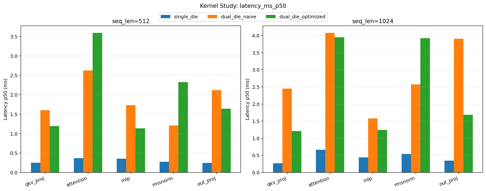
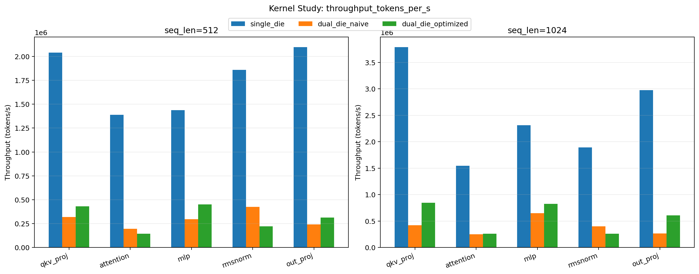
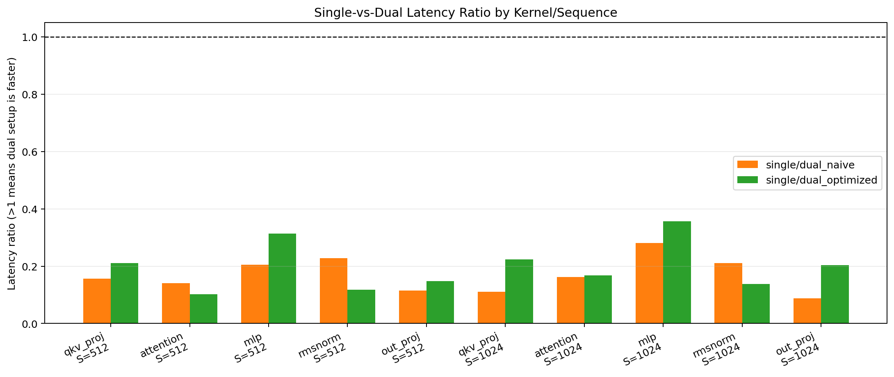
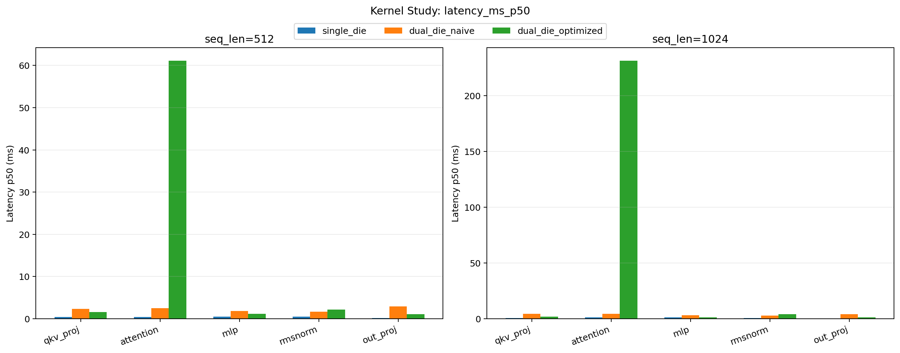
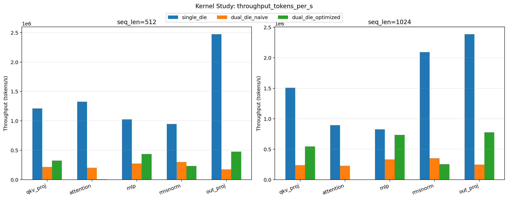
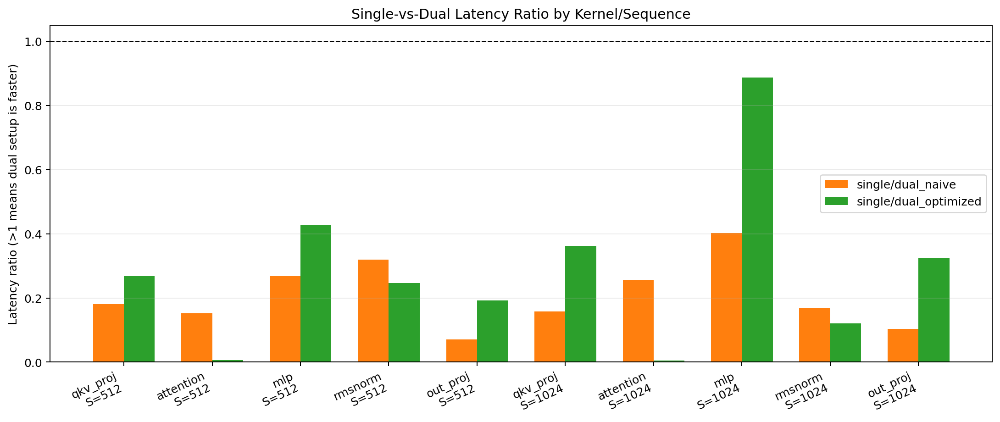

## Phase-aware experiment: where dual-die helps

### Objective

Measure end-to-end prefill and decode behavior to answer:

1. When does dual-die hurt because tensor-parallel communication dominates?
2. When does dual-die help because request/KV-cache sharding increases service throughput?

### Phase study design

- Setups:
  - `single_die`
  - `dual_die_tensor_optimized` (real 2-rank collectives on Trn2)
  - `dual_die_request_sharded` (requests and KV cache partitioned across ranks)
- Prefill:
  - Long contexts `2048 / 4096 / 8192 / 16384`
  - Default Trn2 config keeps strict correctness enabled and runs `seq_len=16384`
    with `single_die + dual_die_request_sharded` (tensor-optimized 16k can be setup-sensitive).
- Decode:
  - Contexts `2048 / 4096 / 8192`
  - Concurrency sweep `8 / 16 / 32`
  - `decode_steps=16`
- Metrics:
  - `latency_ms_p50`, `latency_ms_p90`
  - `compute_ms_p50`, `communication_ms_p50`, `overlap_pct_p50`
  - `throughput_tokens_per_s`
  - `kv_cache_bytes_per_rank`
  - `achieved_link_gbps_p50`, `link_utilization_pct_p50`, `fabric_peak_gbps`
  - `max_abs_err`, robust `max_rel_err`
  - Per-kernel phase breakdown (`kernel_phase_metrics.csv/jsonl`) for
    `qkv_proj / attention / mlp / rmsnorm / out_proj`

### Reproduce phase run

Quick strict (recommended on `trn2.3xlarge`):

```bash
torchrun --nproc_per_node=2 scripts/run_phase_study.py \
  --config configs/experiments/trn2_phase_ultra_strict.yaml \
  --device trainium \
  --distributed \
  --output-dir results/trn2-phase-ultra-strict
```

Full sweep (recommended on larger Trn2 capacity):

```bash
torchrun --nproc_per_node=2 scripts/run_phase_study.py \
  --config configs/experiments/trn2_phase_study.yaml \
  --device trainium \
  --distributed \
  --output-dir results/trn2-phase-real-final-rerun
```

```bash
python scripts/plot_phase_study.py \
  --metrics-csv results/trn2-phase-real-final-rerun/<run_id>/metrics.csv \
  --kernel-phase-csv results/trn2-phase-real-final-rerun/<run_id>/kernel_phase_metrics.csv \
  --out-dir results/plots \
  --prefix trn2_phase_real_final
```

### Latest phase run summary (ultra strict)

Run id: `run_20260305T052604Z` (executed March 5, 2026, config: `configs/experiments/trn2_phase_ultra_strict.yaml`).

- Prefill (`batch=2`):
  - `seq_len=2048`: request-sharded is `0.66x` of single-die speed; tensor-optimized is `0.018x`.
  - `seq_len=4096`: request-sharded is `0.93x` of single-die speed; tensor-optimized is `0.009x`.
- Decode (`context_len=2048`, `decode_steps=1`) is highly sensitive in this small config:
  - Tensor-optimized remains slower than single due communication.
  - Request-sharded includes one strong-concurrency outlier and should be revalidated with `decode_steps>=4` on larger Trn2 capacity.

Practical note:

- Full long-context + multi-step decode sweeps are compile-heavy on `trn2.3xlarge` with dynamic cache growth. Use this ultra config for quick iteration, and run the full `trn2_phase_study.yaml` on larger Trn2 capacity for final report numbers.

Interpretation:

- In this ultra quick run, tensor-parallel decode/prefill remains communication-bound.
- Request-sharded behavior is workload-sensitive and needs multi-step decode reruns on larger Trn2 capacity for stable service-throughput claims.

### Committed phase-study plots

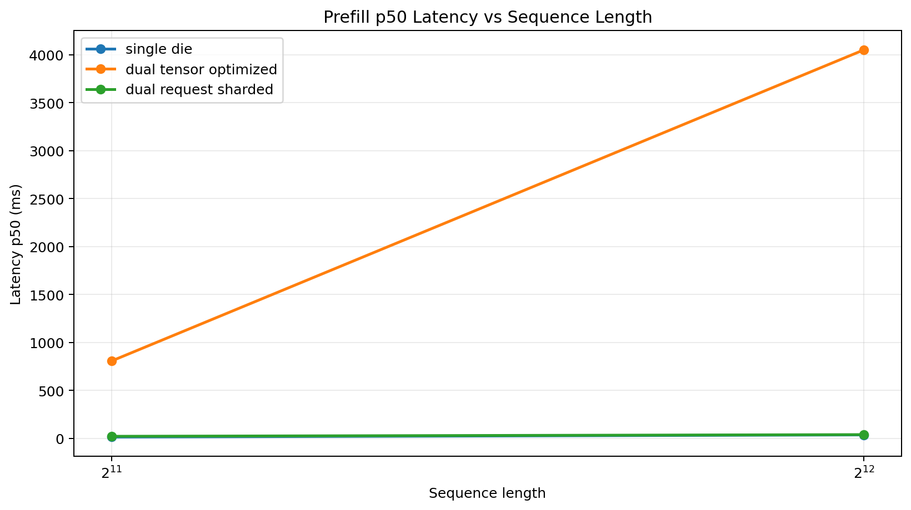
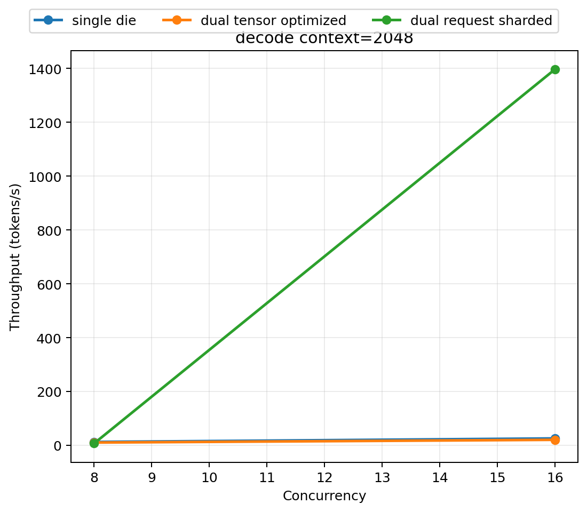
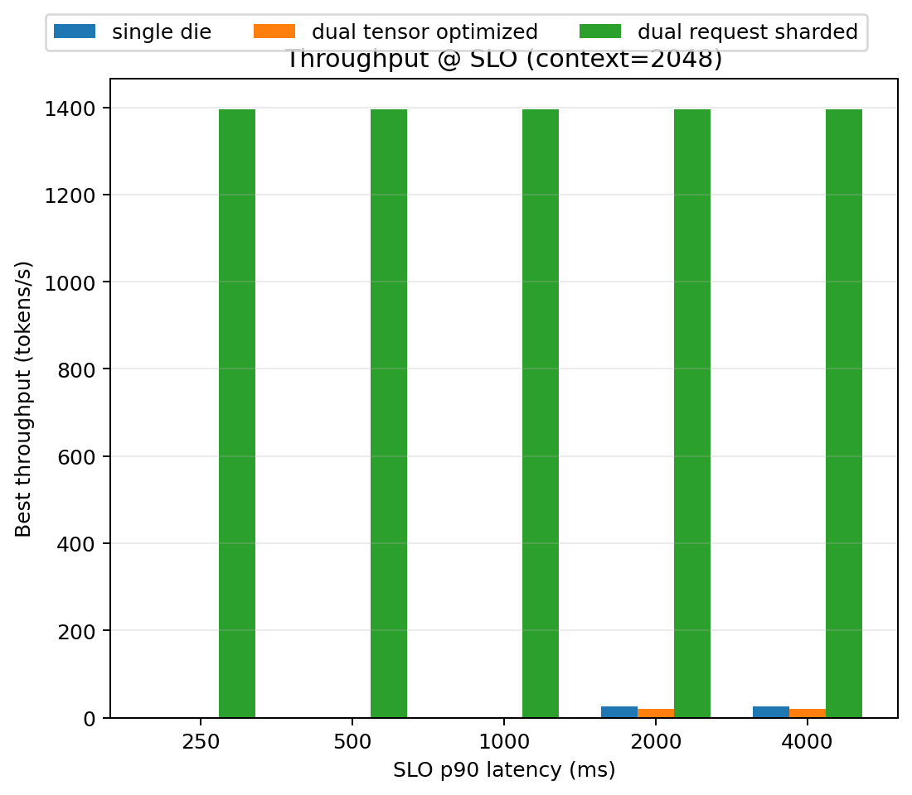
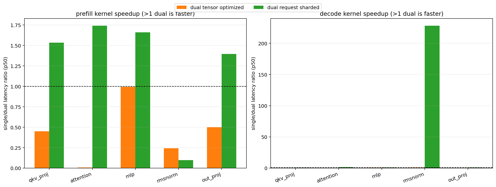
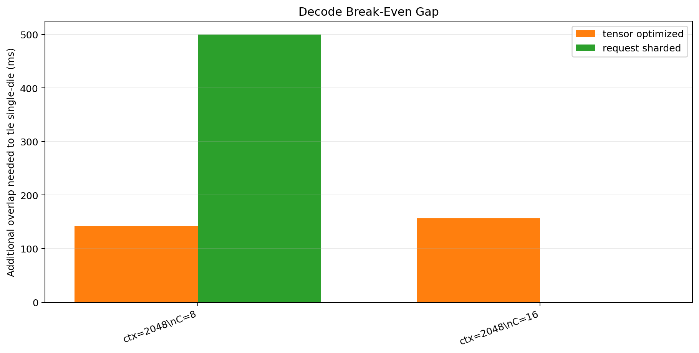

## Artifact schema

Each run directory under `results/` contains:

- `metrics.csv`
- `metrics.jsonl`
- `fabric_calibration.csv` and `fabric_calibration.json` (when distributed calibration is enabled)
- `collectives_summary.json` (per-op `{count, bytes, time}` grouped by setup/kernel/shape/phase)
- `decode_slo_summary.csv` and `decode_slo_summary.md` (phase study)
- `break_even_summary.csv` and `break_even_summary.md` (phase study)
- `kernel_phase_metrics.csv` and `kernel_phase_metrics.jsonl` (phase study)
- `run_manifest.json` with:
  - `git_commit`
  - `timestamp_utc`
  - `instance_type`
  - `device_target`
  - `emulation_level` (`L0`/`L1`/`L2`)
  - `rank_core_masks` (per-rank visible core mask + parsed cores + chip id placeholder)
  - `torch_version`
  - `torch_neuronx_version`
  - `python_version`
  - `benchmark_config_path`
  - `variant`
  - `seed`

`metrics.csv` includes p50 compute time, p50 communication time, overlap percentage, achieved link bandwidth, and link utilization against calibrated fabric peak.
