# AWS Instance Setup

## Table of Contents
* [Launching the instance](#launching-the-instance)
* [AWS Configure](#aws-configure)
    * [New user](#new-user)
* [Create S3 bucket](#create-s3-bucket)
* [Stopping Instance](#stopping-instance)
* [Creating an Alarm](#creating-an-alarm)

## Launching the instance
1. Login to your AWS account with the credentials you have used to create them and navigate to the EC2 dashboard with regions as us-east-1 , United States (N. Virginia). 
<div style="padding-left: 0px; padding-bottom: 30px; text-align: center;">
        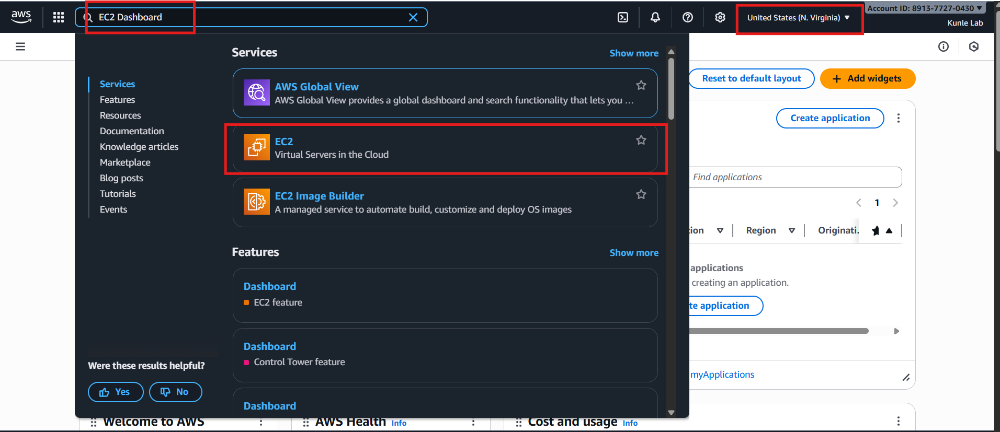
    </div>
2. Click "Launch Instance"
<div style="padding-left: 0px; padding-bottom: 30px; text-align: center;">
        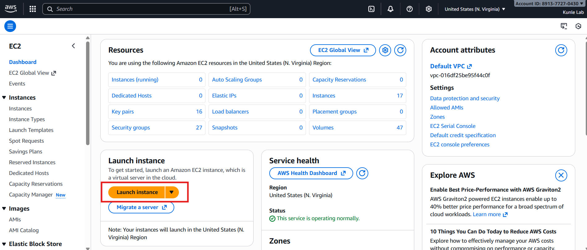
    </div>
3. Create a name for your instance - feel free to use your SUNet ID as well
<div style="padding-left: 0px; padding-bottom: 30px; text-align: center;">
        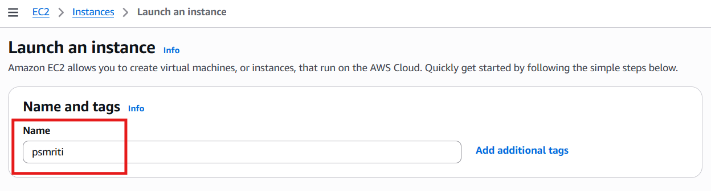
    </div>
4. Click on `Browse more AMIs` AMI after selecting Ubuntu
<div style="padding-left: 0px; padding-bottom: 30px; text-align: center;">
        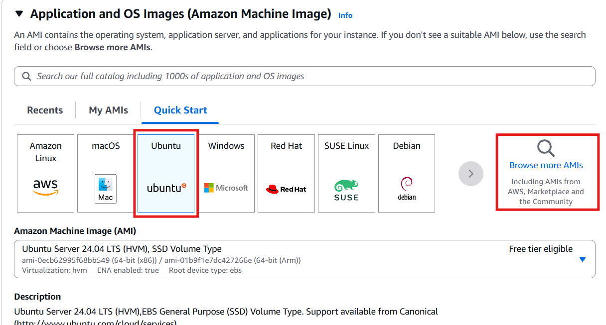
    </div>
5. search for `FPGA Developer AMI` and select the `Ver 1.16.1` version, select `subscribe on instance launch` and confirm changes 
<div style="padding-left: 0px; padding-bottom: 30px; text-align: center;">
        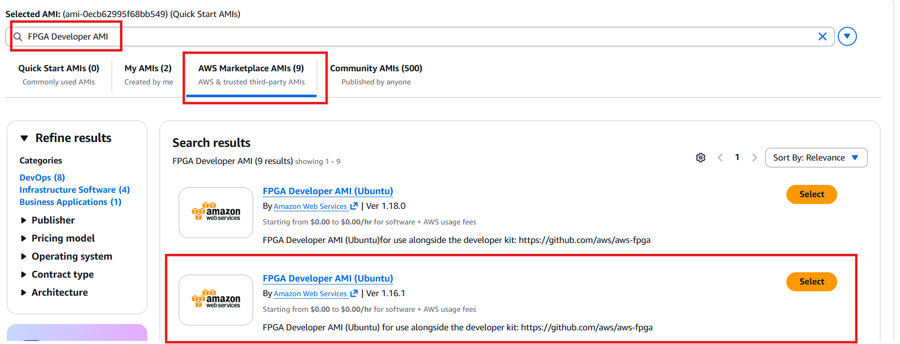
    </div>
6. Select instance type as `f2.6xlarge` and create a new key pair for your instance with `key pair name` of your choice and save it locally preferably to the `.ssh` folder
<div style="padding-left: 0px; padding-bottom: 30px; text-align: center;">
        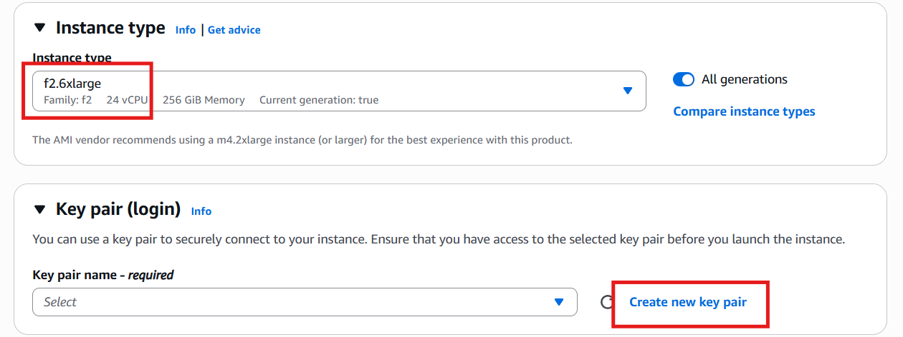
    </div>

<div style="padding-left: 0px; padding-bottom: 30px; text-align: center;">
        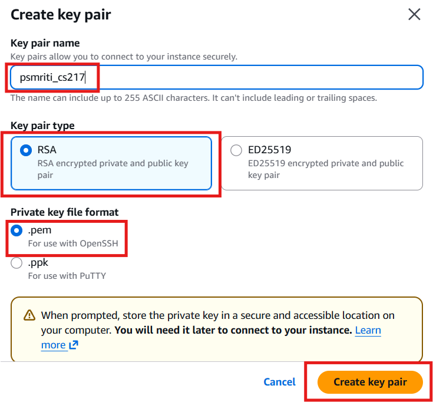
    </div>
7. Select the security group
<div style="padding-left: 0px; padding-bottom: 30px; text-align: center;">
        
    </div>
8. Launch the instance and click on the instance id link
    <div style="padding-left: 0px; padding-bottom: 30px; text-align: center;">
            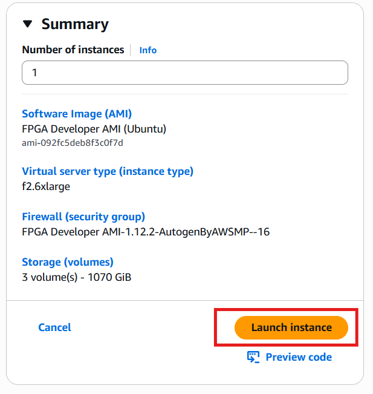
        </div>
    <div style="padding-left: 0px; padding-bottom: 30px; text-align: center;">
            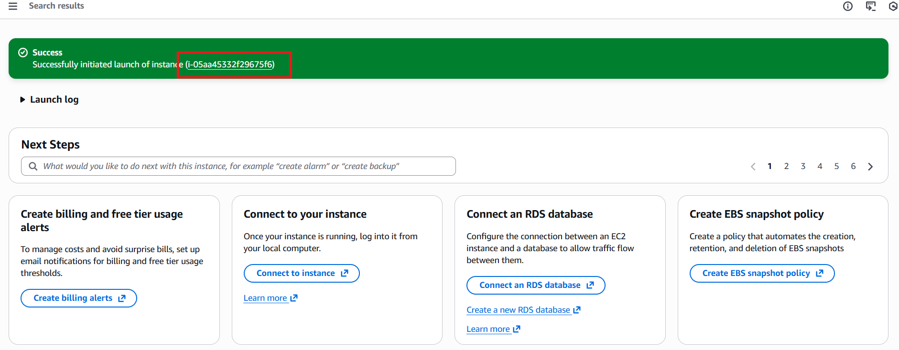
        </div>
9. Click connect
    <div style="padding-left: 0px; padding-top: 0px; text-align: center;">
        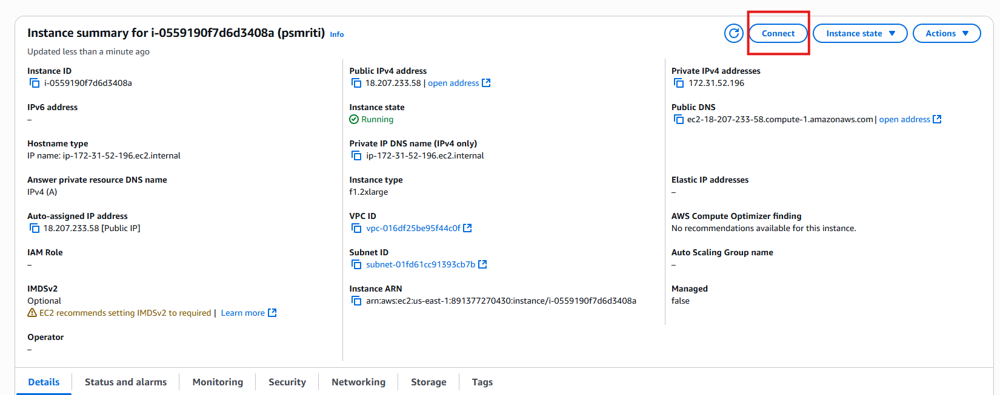
    </div>

10. Move to the 'SSH Client' tab and copy the address shown in the boxed field in this picture. This address changes whenever you start the instance. 
    <div style="padding-left: 0px; padding-top: 10px; padding-bottom: 30px; text-align: center;">
        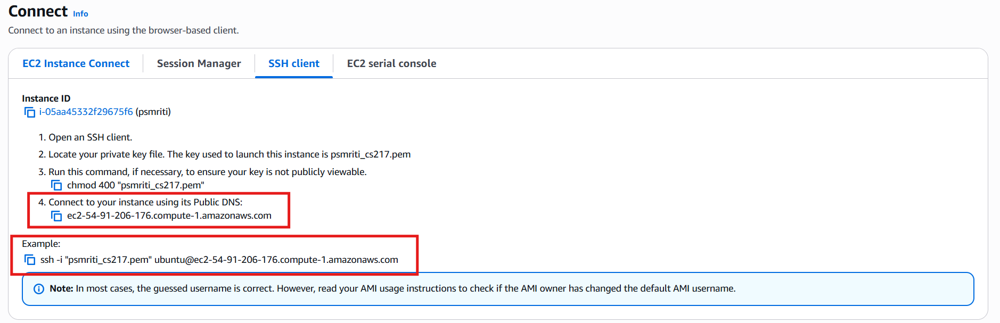
    </div>
10. SSH into your instance
    1. Option 1: VSCode (We recommend this option when you edit code & run)
        1. Install the 'remote-ssh' extension. Press the small button on the lower right and select **Connect to host > Configure SSH Hosts** and choose the first file (this will look something like `\user\$USERNAME\.ssh\config`).
        <div style="padding-left: 0px; padding-bottom: 30px; text-align: center;">
            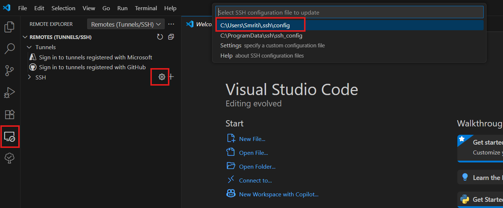
        </div>

        2. Add the following entry to the file and save it. The value for `HostName` is the address you copied in step 5. **This address changes whenever you start the instance. So you will have to update this field whenever you stop and re-start the instance.** The 'IdentityFile' field is the location where you saved the private key pem file earlier. 
        ```
        Host aws_cs217
        HostName ec2-54-91-206-176.compute-1.amazonaws.com
        IdentityFile "C:\Users\Smriti\.ssh\psmriti_cs217.pem"
        User ubuntu
        ```
        3. Selecting the newly added AWS host for remote SSH will connect you to your instance. Once you're connected, you can open folders in your instance using the 'File > Open Folder' feature and run code using the 'Terminal > New Terminal' feature.

    2. Option 2: Terminal (We recommend this option when you want to open a gui to view the emulation reports). The value after the `-i` option is the location of the private key.
    ```
    ssh -i \Users\Smriti\.ssh\psmriti_cs217.pem ubuntu@ec2-18-207-233-58.compute-1.amazonaws.com
    ``` 
## AWS Configure
1. Obtain your AWS Access key and secret access key - navigate to IAM from AWS dashboard. Navigate to user > [Your user name]. If a user doesn't exist, check the section [New User](#new-user)
2. Please check the that the following permissions exist 
    <div style="padding-left: 0px; padding-bottom: 30px; text-align: center;">
            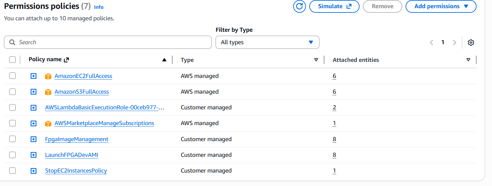
    </div>
3. create Access key 1 with the the following settings
<div style="padding-left: 0px; padding-bottom: 30px; text-align: center;">
            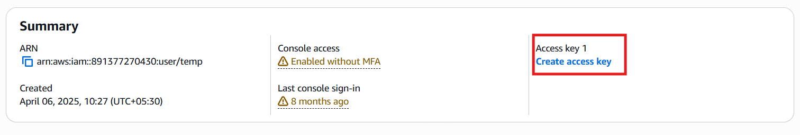
    </div>
<div style="padding-left: 0px; padding-bottom: 30px; text-align: center;">
            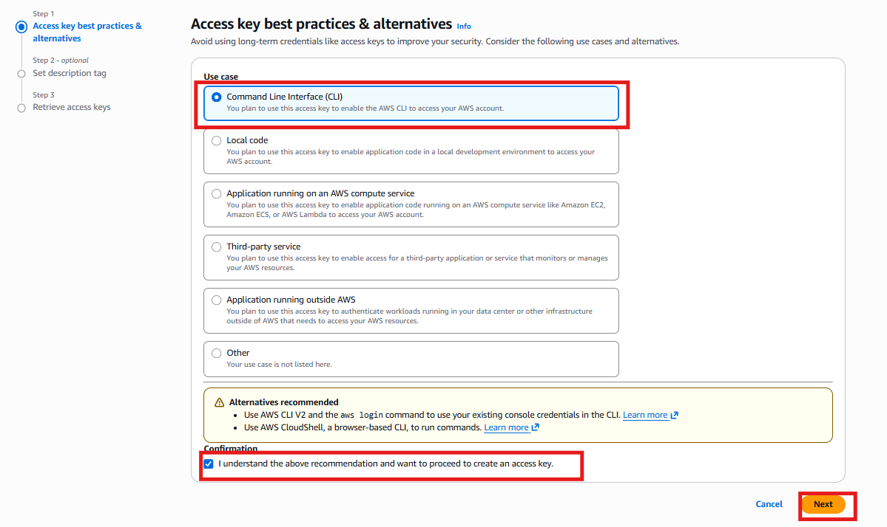
    </div>
4. Yoi can "Set description tag" if you want and proceed with "Create Access Key"
    <div style="padding-left: 0px; padding-bottom: 30px; text-align: center;">
            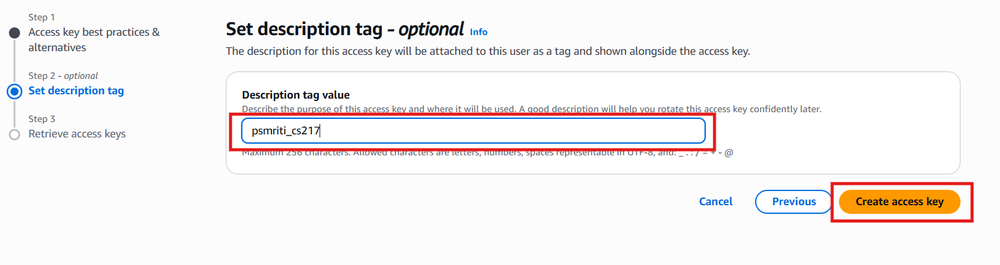
    </div>
5. Make a note of the "Access Key" and "Secret Access key". You can only view this once, so please download the .csv 
    <div style="padding-left: 0px; padding-bottom: 30px; text-align: center;">
            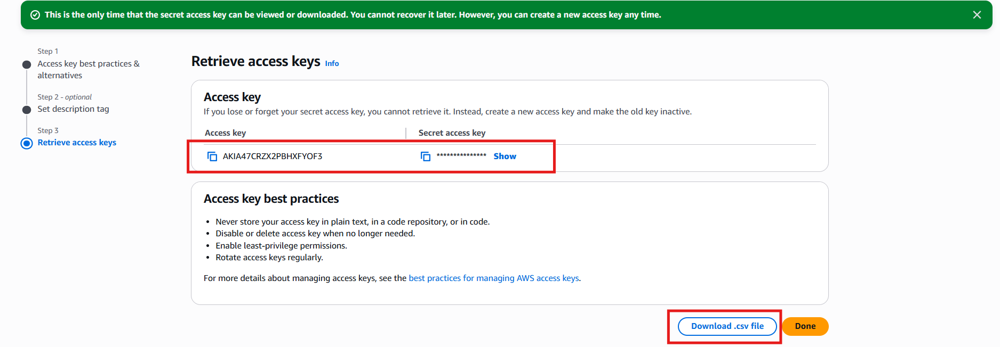
    </div>
6. On your instance, configure the aws settings `aws configure`. Set your credentials, region, and output format. If you run the following command, it will ask you for Access Key ID and Secret Access Key, For the region, write 'us-east-1' and for the output write `json`

 ```
 aws configure
 ```
 The result should look like:
 ```
 [centos@ip-172-31-21-2 src]$ aws configure
 AWS Access Key ID [None]: <Your Access Key>
 AWS Secret Access Key [None]: <Your Secret Access Key>
 Default region name [None]: us-east-1
 Default output format [None]: json
 ```

 ### New user
 1. Create a new user and add the user name
 2. `Attach Policies Directly` and add the permissions as give below
    <div style="padding-left: 0px; padding-bottom: 30px; text-align: center;">
            
        </div>
3. After user is created please go to the steps outlined in [AWS Configure](#aws-configure)

## Create S3 bucket 
S3 Bucket is used to upload and store the generated Amazon FPGA image (AFI). Please follow the steps below to create the S3 bucket
1. Add the following to the bashrc (`~/.bashrc`) and open a new terminal
```
export DCP_BUCKET_NAME=<SUNetID>
export DCP_FOLDER_NAME=cs217_labs
export REGION=us-east-1
export LOGS_FOLDER_NAME=logs_folder
export LOGS_BUCKET_NAME=$DCP_BUCKET_NAME
```
2. Run the following commands. If your chosen DCP_BUCKET_NAME gives you an error in creating the S3 bucket, use any unique ID.
```
# Create an S3 bucket (choose a unique bucket name)
aws s3 mb s3://${DCP_BUCKET_NAME} --region ${REGION}

# Create a folder for your tarball files
aws s3 mb s3://${DCP_BUCKET_NAME}/${DCP_FOLDER_NAME}/

# Create a folder to keep your logs
aws s3 mb s3://${LOGS_BUCKET_NAME}/${LOGS_FOLDER_NAME}/ --region ${REGION}

# Create a temp file
touch LOGS_FILES_GO_HERE.txt

# Create the folder on S3
aws s3 cp LOGS_FILES_GO_HERE.txt s3://${LOGS_BUCKET_NAME}/${LOGS_FOLDER_NAME}/
```

## Stopping Instance
The credits are used based on the number of hours the instance is run. Always turn off the instance once you are done
1. To the stop the instance navigate to the EC2 > Instances. Clock "stop intance" nder the "Instance State' drop down. It will take sometime for the instance to shut down. 
    <div style="padding-left: 0px; padding-bottom: 30px; text-align: center;">
            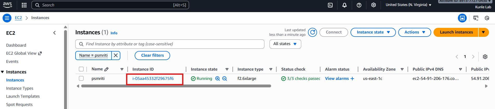
    </div>
    <div style="padding-left: 0px; padding-bottom: 30px; text-align: center;">
        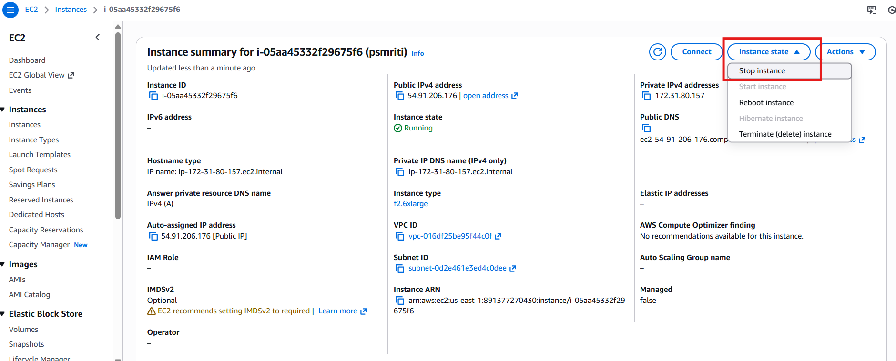
    </div>
2. You can also stop it by running the following command on the terminal `sudo shutdown -h now`

## Creating an Alarm 
Please create an alarm for the instance so that it stops once the instance has been unintentionally not turned off. However, please always manually stop the instnace. 
1. Create the alarm and configure the settings as shown 
    <div style="padding-left: 0px; padding-bottom: 30px; text-align: center;">
            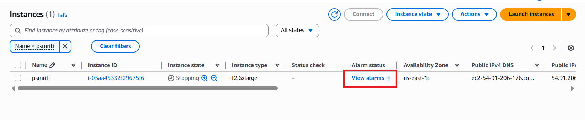
    </div>
    <div style="padding-left: 0px; padding-bottom: 30px; text-align: center;">
        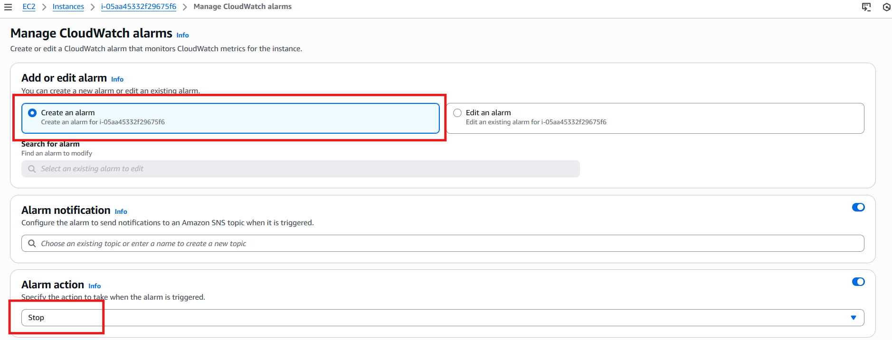
    </div>
2. scroll down and select "Create"