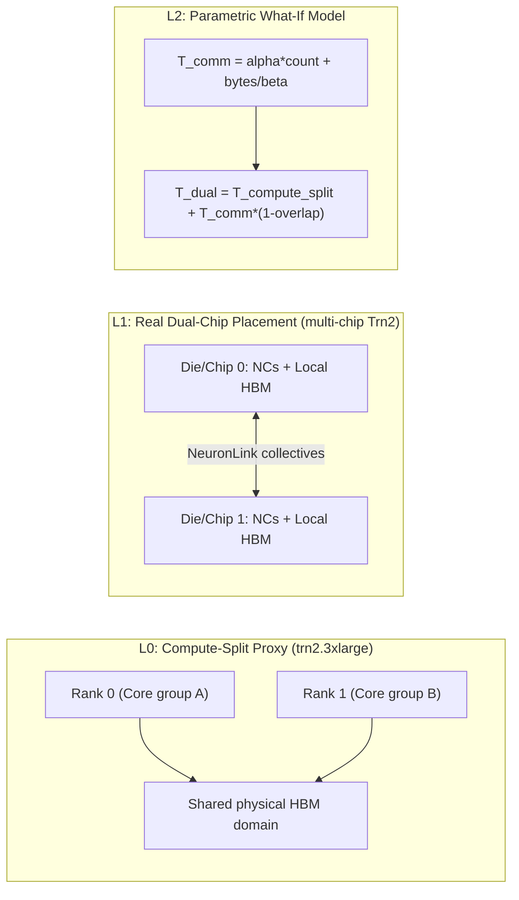
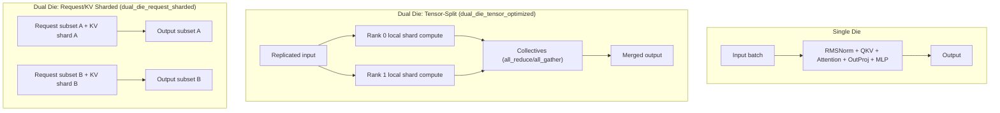
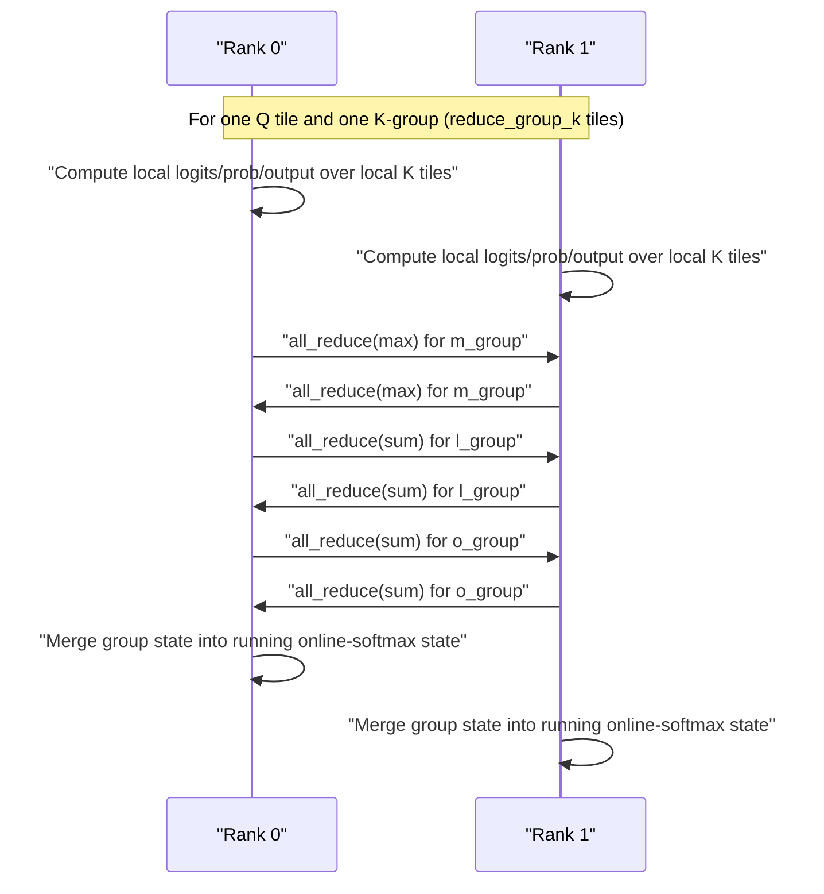

# Dual-Die Compute Diagrams

This document shows how compute and communication differ across single-die and dual-die execution modes.

## 1) Emulation and Hardware Mapping

## 2) End-to-End Compute Path Differences

## 3) Distributed Attention (Optimized Merge)

Grouped distributed online-softmax merge (new optimization) reduces collective count by merging several K tiles locally before global reductions.

## 4) Kernel-Level Communication Pattern

| Kernel | Single Die | Dual Naive | Dual Optimized |
|---|---|---|---|
| `qkv_proj` | local GEMM | split + gather | split + reduced gather |
| `attention` | local SDPA | gather-heavy logits path | distributed online-softmax merge with reductions |
| `mlp` | local GEMMs | hidden gather path | split + reduction combine |
| `rmsnorm` | local | gather path | gather + small reductions |
| `out_proj` | local GEMM | gather path | split + reduction combine |

## 5) Why Inference Story Uses Different Metrics

- Prefill: long-context latency ratio (`dual/single`) by sequence length.
- Decode: throughput-at-SLO frontier by context length and concurrency.
- Capacity: tokens/s per GiB KV cache footprint.
- Bottleneck attribution: compute vs communication stacked latency.
