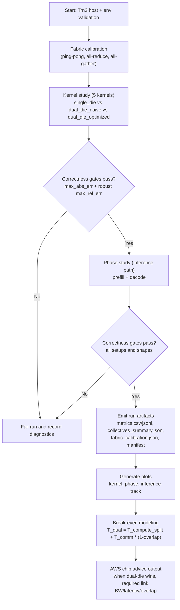
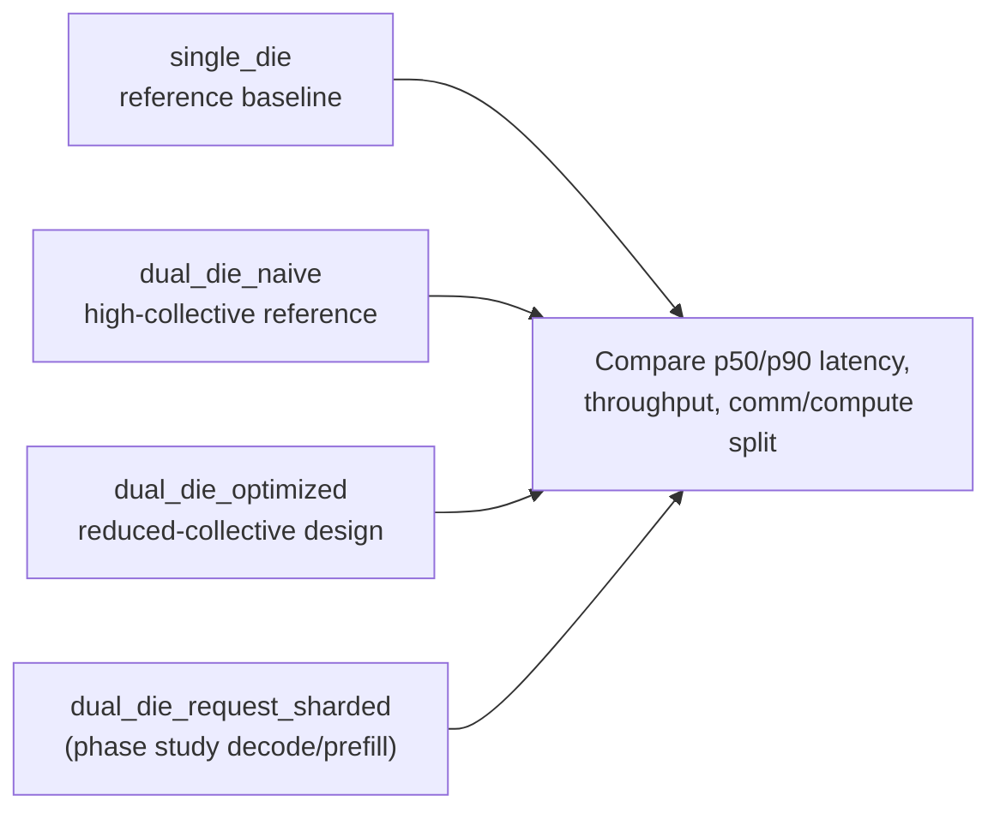

# Experiment Validation Diagram

This document describes the exact execution and validation flow used for Trn2 dual-die experiments.

## End-to-End Flow

## Setup and Measurement Matrix

## Validation Gates

- Gate 1: Numerical correctness against single-die reference.
- Gate 2: Run must include fabric calibration and collective summaries.
- Gate 3: Per-run manifest records setup, device, and configuration.
- Gate 4: Plot generation from run artifacts must complete without missing inputs.

## Why this is credible

- Separates wall time and communication time explicitly, with overlap reported only when it is directly observable or clearly marked as an estimate.
- Tracks communication bytes and calibration-relative effective link rate per setup.
- Uses both kernel-level and end-to-end phase-level measurements.
- Includes break-even modeling to map today’s data to next-gen chip requirements.
